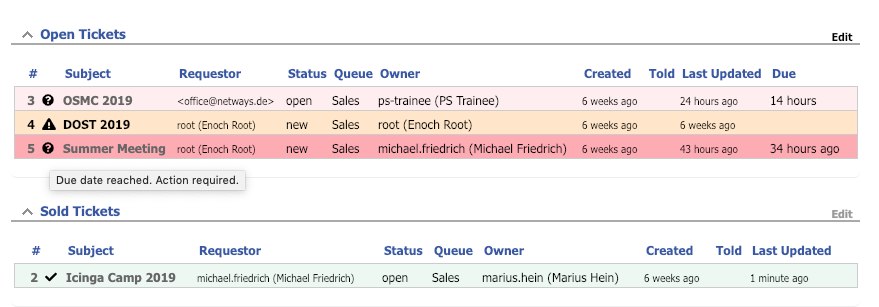

# Search Result Extension for Request Tracker

#### Table of Contents

1. [About](#about)
2. [License](#license)
3. [Support](#support)
4. [Requirements](#requirements)
5. [Installation](#installation)
6. [Configuration](#configuration)

## About

You can use this extension e.g. for the following scenarios:

* Immediately visualize open tasks with customer replies on tickets.
* Highlight workflow steps with custom fields. Ticket bought -> on hold, action required. Ticket received -> say thanks, close ticket.

The search result rows can be highlighted matching defined conditions:

* Custom name matches value
* Last Updated By is not the ticket owner or in a specified group

The rows can be highlighted with

* Transparent background color
* Icon as an additional column from the extended search editor.



## License

This project is licensed under the terms of the GNU General Public License Version 2.

This software is Copyright (c) 2018 by NETWAYS GmbH <[support@netways.de](mailto:support@netways.de)>.

## Support

For bugs and feature requests please head over to our [issue tracker](https://github.com/NETWAYS/rt-extension-searchresult/issues).
You may also send us an email to [support@netways.de](mailto:support@netways.de) for general questions or to get technical support.

## Requirements

- RT 4.4.3
- Search results containing a NEWLINE separator need [PR #273](https://github.com/bestpractical/rt/pull/273).

## Installation

Extract this extension to a temporary location.

Git clone:

```
cd /usr/local/src
git clone https://github.com/NETWAYS/rt-extension-searchresult
```

Tarball download (latest [release](https://github.com/NETWAYS/rt-extension-searchresult/releases/latest)):

```
cd /usr/local/src
wget https://github.com/NETWAYS/rt-extension-searchresult/archive/master.zip
unzip master.zip
```

Navigate into the source directory and install the extension.

```
perl Makefile.PL
make
make install
```

Clear your mason cache.

```
rm -rf /opt/rt4/var/mason_data/obj
```

Restart your web server.

```
systemctl restart httpd

systemctl restart apache2
```

## Configuration

### Highlight on Relative Due Date

The search result row will be highlighted when a due date is
set and lower than the smallest value defined as condition.

You can for example define a softer color for `due in 8 days`
than `due in 3 days`.

Each configuration entry requires

Key           | Description
--------------|----------------
`conditions`  | **Required.** One or multiple key-value pairs in the format `"due" => <number of days>`.
`color`       | **Optional.** Background color for the highlighted search result line. Supported colors are listed below.
`icon`        | **Optional.** FontAwesome icon available as additional column in search results, when the condition matches.

#### Example

```perl
Set($SearchResult_HighlightOnDueDate,
[
{
  "conditions" => { "due" => 3 },
  "color" => "red",
  "icon" => "fa-circle"
},
{
  "conditions" => { "due" => 5 },
  "color" => "yellow",
  "icon" => "fa-check"
},
]
);
```

### Highlight on CF Condition

The search result row will be highlighted when a CF name
matches a specified value.

You can define multiple highlights at once. Each configuration entry
requires

Key           | Description
--------------|----------------
`conditions`  | **Required.** One or multiple key-value pairs in the format `CF_name => CF_expected_value`.
`color`       | **Optional.** Background color for the highlighted search result line. Supported colors are listed below.
`icon`        | **Optional.** FontAwesome icon available as additional column in search results, when the condition matches.

#### Example

```perl
Set($SearchResult_HighlightOnCFCondition,
[
{
  "conditions" => { "TicketReceived" => "yes" },
  "color" => "green",
  "icon" => "fa-check"
},
{
  "conditions" => { "TicketBought" => "yes" },
  "color" => "red",
  "icon" => "fa-pause"
}
]
);
```

### Highlight On Last Updated By Condition

This can be used to highlight the search result row
if

* The owner is not the same as the last updated by user
* The last updated by user is not in one of the specified RT groups.

You can define multiple highlights at once. Each configuration entry
requires

Key           | Description
--------------|----------------
`conditions`  | **Required.** One or multiple key-value pairs in the format `"owner" => 1` or `"groups" => [ "<groupname>" ]`.
`color`       | **Optional.** Background color for the highlighted search result line. Supported colors are listed below.
`icon`        | **Optional.** FontAwesome icon available as additional column in search results, when the condition matches.

```perl
Set($SearchResult_HighlightOnLastUpdatedByCondition,
[
#{
#  "conditions" => { "owner" => 1 },
#  "color" => "blue",
#  "icon" => "fa-star"
#},
{
  "conditions" => { "groups" => [ "admins" ] },
  "color" => "purple",
  "icon" => "fa-exclamation-circle"
}
]
);
```

### Colors

`red`, `green`, `blue`, `yellow`, `purple`, `grey`.

### Font Awesome Icons

[Font Awesome](https://fontawesome.com) 4.0 SVG icon set is
included, you can use for example:

* fa-envelope
* fa-comment
* fa-share
* fa-folder-open
* fa-check
* fa-ban
* fa-trash-alt
* fa-star
* fa-sync-alt
* fa-pause
* fa-copy
* fa-check-circle
* fa-pause-circle
* fa-user-secret
* fa-recycle
* fa-cloud-upload-alt
